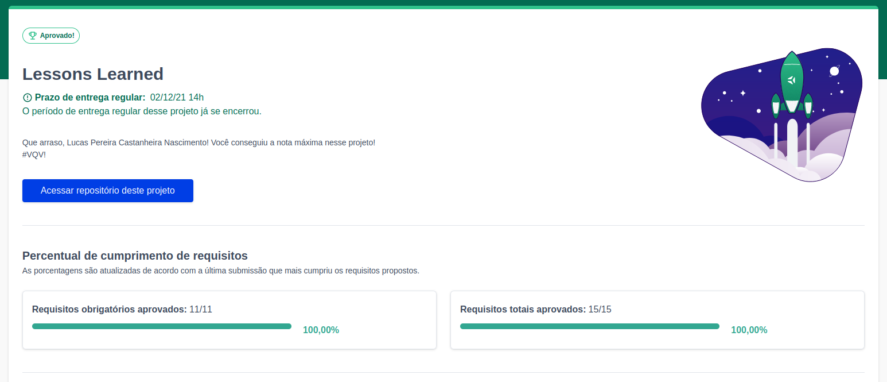
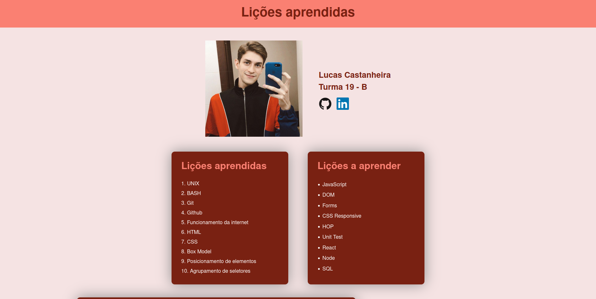

# Lessons Learned

<h2>:brazil: Português :brazil:</h2>

Projeto entregue durante o curso de desenvolvimento Web ministrado pela <a href="https://www.betrybe.com" targe="_blank" rel="nofollow">Trybe</a>.

Obtive a aprovação no projeto, completando 100% dos requisitos obrigatórios e opcionais. Efetivando, assim, a conclusão do Bloco 3 (Introdução à HTML e CSS) referente ao Módulo 1 (Fundamentos do Desenvolvimento Web).

Descrição: 
 
O projeto tinha como objetivo desenvolver uma página HTML estilizada com CSS. Ao elaborar o projeto pude realizar a construção do código HTML, praticar posicionamento e estilização CSS e aplicar conceitos de semântica apropriados para que o site fosse acessível e melhor ranqueado.
 
O site criado possui uma série de informações sobre o que aprendi até aquele momento do curso e como tem sido a minha experiência de aprendizado.
 
Link para conferência: https://Lucas-PCN.github.io/lessons-learned/

 

<h2>:us: English :us:</h2>

Project delivered during the Web development course taught by <a href="https://www.betrybe.com" targe="_blank" rel="nofollow">Trybe</a>.

I passed the project, completing 100% of mandatory and optional requirements. Thus, completing Block 3 (Introduction to HTML and CSS) referring to Module 1 (Fundamentals of Web Development).

Description:
 
The project aimed to develop an HTML page styled with CSS. When developing the project, I was able to build the HTML code, practice CSS positioning and styling and apply appropriate semantic concepts so that the site was accessible and better ranked.
 
The website created has a series of information about what I learned so far in the course and how my learning experience has been.
 
Conference link: https://Lucas-PCN.github.io/lessons-learned/

